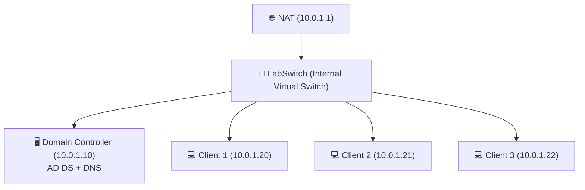

# **Domain Controller Setup**

---

This guide covers the installation and configuration of a **Domain Controller (DC)** with **Active Directory Domain Services (AD DS)** and **DNS**, as well as basic network settings for a Hyper-V lab environment.

Click [Set up a Configuration Manager lab](https://learn.microsoft.com/en-us/intune/configmgr/core/get-started/set-up-your-lab) for detailed setup instructions and access to all necessary download links for the lab.

---

## **1. Install AD DS and DNS**

1. Open **Server Manager** → **Manage** → **Add Roles and Features**  
   
2. Select and install the following roles:
   > - **Active Directory Domain Services (AD DS)**  
   > - **DNS Server**

---

## **2. Promote the Server to a Domain Controller**

> - After installation, in **Server Manager**, click **Promote this server to a domain controller**.  
> - Choose **Add a new forest** and provide a root domain name (e.g., `lab.com`).  
> - Complete the wizard and restart the server once promotion is finished.  

---

## **3. (Optional) Network Configuration for All VMs**
If using **Hyper-V** with a NAT-enabled Internal Switch (e.g., `LabSwitch`), configure network settings for all VMs:

### **Steps:**

1. Attach each VM’s network adapter to the **LabSwitch** virtual switch.  
2. Assign static IP addresses on each VM:  

**Example Configuration (10.0.1.0/24 subnet):**

| VM Role        | IP Address   | Subnet Mask     | Gateway   | DNS Settings             |
|----------------|-------------|-----------------|-----------|--------------------------|
| Domain Controller (DC) | `10.0.1.10` | `255.255.255.0` | `10.0.1.1` | `127.0.0.1`, `1.1.1.1` |
| Other Servers / Clients | `10.0.1.X`  | `255.255.255.0` | `10.0.1.1` | `<DC-IP>`, `1.1.1.1` |

---

## **Network Layout Diagram**

---

## **4. Join All Machines to the Domain**

1. On each server or client VM:  
   > - Open **System Properties** (`sysdm.cpl`).  
   > - Under **Computer Name**, click **Change**.  
   > - Select **Domain**, enter the domain name (e.g., `lab.com`), and provide credentials.  

2. Restart each machine after joining the domain.  

---

✅ At this point, your **Domain Controller with AD DS and DNS** is fully set up, and all lab VMs should be joined to the domain.  