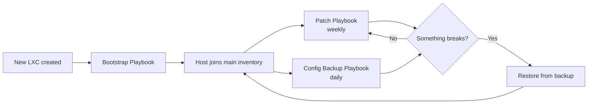

# Ansible Automation: The Full Lifecycle

## Overview

The three playbooks in this section aren't independent scripts — they're stages of one system that manages a Linux host from the moment it's created to the moment something goes wrong and needs to be restored. This page ties them together and explains how they hand off to each other.



---

## Stage 1 — Bootstrap (Day 0)

**[Ansible LXC Bootstrap](ansible-lxc-bootstrap.md)**

Every host's life starts here, and only here. This playbook runs exactly once per host, using temporary root/password access, and hands off to key-based automation from that point forward:

- Creates the dedicated `ansible` service account
- Installs the SSH key the rest of the automation stack will use
- Applies baseline hardening (SSH config, UFW, fail2ban)
- Installs common packages every host needs regardless of role

Once this playbook finishes, the host graduates from a one-off `bootstrap_hosts.ini` entry into the main inventory — from here on, it's managed the same way as every other host in the lab.

---

## Stage 2 — Ongoing Maintenance (Every Week / Every Day)

Two playbooks run continuously in the background once a host is onboarded, on independent, offset schedules:

| Playbook | Frequency | Purpose |
|---|---|---|
| **[Patch Automation](ansible-patch.md)** | Weekly (Sun 3 AM) | Keeps packages current, reboots only when required |
| **[Config Backup](ansible-config-backup.md)** | Daily (1 AM) | Archives critical app/system config to the control node |

They're deliberately scheduled a few hours apart within the same maintenance window — backup runs *before* patching, so if a patch cycle ever breaks something, there's always a same-day config snapshot to fall back to rather than relying on whatever the last weekly backup happened to catch.

```cron
# Daily config backup — 1:00 AM
0 1 * * * ansible-playbook -i hosts.ini backup_configs.yml

# Weekly prune — Sunday 2:00 AM
0 2 * * 0 ansible-playbook -i hosts.ini prune_backups.yml

# Weekly patch — Sunday 3:00 AM
0 3 * * 0 ansible-playbook -i hosts.ini update_lab.yml
```

Both playbooks target the **same inventory** (`hosts.ini`) — a host only needs to be defined once, and it's automatically covered by both.

---

## Stage 3 — Recovery (When Something Breaks)

This is the payoff for maintaining Stage 2 consistently. When a service breaks — a bad config edit, a corrupted upgrade, a container that needs rebuilding — the recovery path is:

1. **If it's a config problem** → pull the most recent archive from `/root/ansible-backups/<host>/`, extract, and restore the specific file(s) needed (see [Config Backup → Restoring](ansible-config-backup.md#restoring-from-a-backup)).
2. **If it's a whole-container problem** → rebuild the LXC from a Proxmox template, run the [Bootstrap Playbook](ansible-lxc-bootstrap.md) against it, then restore configs from the last backup before reintroducing it to service.

Either path returns the host to Stage 2 — back under normal patch and backup coverage — rather than requiring anything to be reconfigured by hand.

---

## Why This Order Matters

Each stage depends on the one before it actually happening:

- Patch and backup playbooks assume the `ansible` account and SSH key already exist — **skip bootstrap, and neither playbook can even connect.**
- Recovery assumes backups have been running long enough to have something recent to restore — **skip consistent Stage 2 runs, and Stage 3 has nothing to work with.**

The lesson from building this out: automation is only as good as its weakest, most-skipped stage. A host that got manually configured and never went through bootstrap is a host that's quietly missing from the whole system — it won't show up as a failure anywhere, it'll just silently not be covered.

---

## One Inventory, Two Purposes

Worth calling out explicitly: `bootstrap_hosts.ini` and `hosts.ini` are **not** the same file, and that's intentional:

- `bootstrap_hosts.ini` — short-lived, root/password auth, used once per host and then that entry is removed
- `hosts.ini` — the permanent inventory, key-based auth, used by every recurring playbook

A host should only ever exist in one of these at a time. If a host is still listed in `bootstrap_hosts.ini` after it's been through Stage 1, that's a sign the promotion step (moving it to the main inventory) got missed.

---

## At a Glance

| Stage | Playbook | Trigger | Auth Method |
|---|---|---|---|
| 0 — Bootstrap | `bootstrap_lxc.yml` | Manual, once per host | Root + password |
| 2 — Patch | `update_lab.yml` | Cron, weekly | `ansible` user + SSH key |
| 2 — Backup | `backup_configs.yml` | Cron, daily | `ansible` user + SSH key |
| 3 — Recovery | Manual restore + re-run Stage 0/2 | As needed | `ansible` user + SSH key |

---

## What's Next

This covers the lifecycle for general-purpose Linux hosts. Natural extensions from here:

- A **health check playbook** to catch problems between scheduled patch/backup runs rather than only discovering them after the fact
- **Role-specific bootstrap variants** (e.g. a Docker-ready bootstrap for containerized services) once enough hosts share a common "type"
- Moving `backup_root_local` off the control node entirely, so Stage 3 recovery doesn't depend on the control node itself surviving